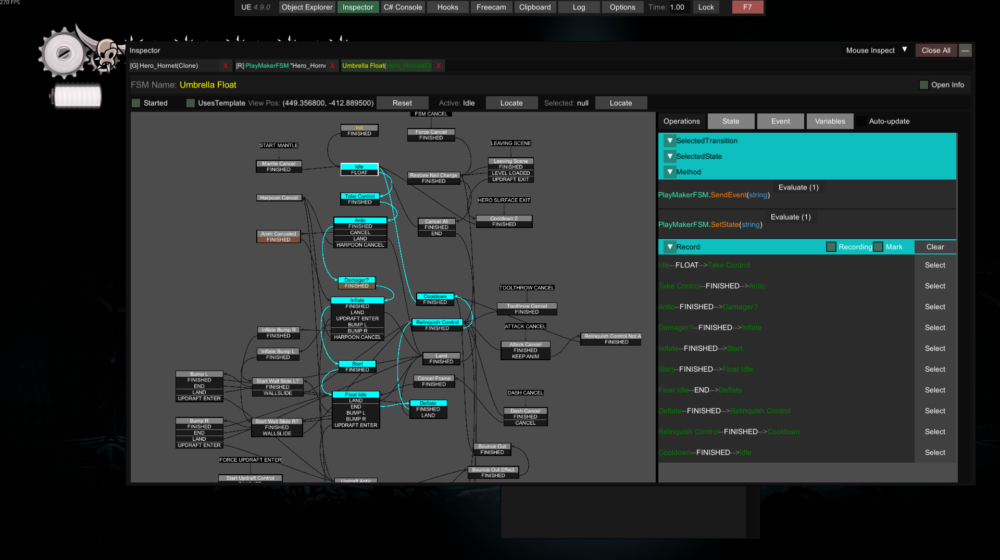

# UEP

There is a useful mod called UnityExplorerPlus (find it [there](https://github.com/HK-Modding-Preservation/Box074/)), which is made for HollowKnight. This mod port some of it's features to silksong and might be helpful for modding developers.

Additionally, I also referenced [FSMExpress](https://github.com/nesrak1/FSMExpress) to implement an in-game FSM viewer in this mod, which can help you know exactly how the FSM runs.

This mod should be used with [UnityExplorer](https://github.com/sinai-dev/UnityExplorer).

## Implemented features

- Show Fsm Info in the list view.
- Add Collider/Enemy/Renderer Inspect.
- Show and Dump extracted sprite and tk2dsprite.
- Show shader info in inspector of Material.
- In-game Fsm viewer.
- ...

## For FSM Viewer

* When you inspect a PlayMakerFSM, a button labeled "Open Fsm Inspector" will appear in the upper-right corner. Click it to open the viewer.
* The State, Event, and Variables pages function identically to their counterparts in FSMExpress.
* The Operations page displays the currently selected State and Transition. With "Recording" enabled, it can also log the FSM's transition process.
* Occasionally, connection lines may appear in incorrect positions. Reopening the viewer typically resolves this issue. If you know how to fix it permanently, feel free to raise a Pull Request.

